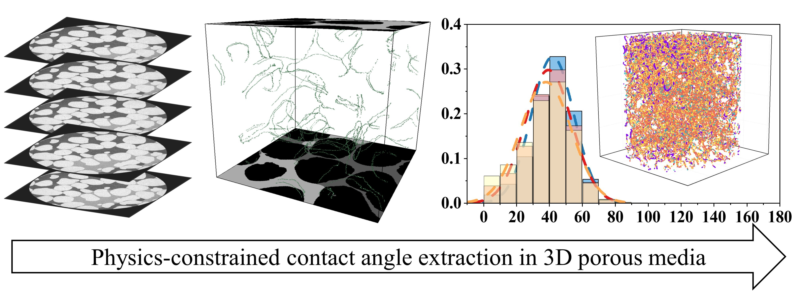

# Contact-angle extraction in 3D porous media



[English](#english) | [中文](#中文)

## English

### Purpose

This Python code quantifies local three-dimensional contact angles from segmented multiphase CT images of porous media.

The workflow identifies solid-water and water-gas interfaces, detects candidate three-phase contact points, filters unreliable local configurations, fits local interface planes using singular value decomposition (SVD), orients the corresponding interface normals from the phase labels, and calculates the contact angle from the angle between the two oriented normal vectors. The resulting contact-angle distribution, spatial coordinates, local phase fractions, rejection statistics, and summary statistics are exported for subsequent analysis.

### Associated paper and citation

This code implements and supports the physics-constrained contact-angle extraction workflow reported in:

> Guo, Z., Jin, F., Wang, K., Zhuang, Y., Suo, S., Torres, S. A. G., & Lei, L. (2026). *Physics-constrained contact angle extraction in 3D porous media*. SSRN preprint. Available at [SSRN](https://ssrn.com/abstract=6641861) or [https://doi.org/10.2139/ssrn.6641861](https://doi.org/10.2139/ssrn.6641861).

The code helps users identify solid-water and water-gas interfaces and candidate three-phase contact points in segmented 3D CT images; reject unreliable or non-physical local configurations; fit local interface planes and orient their normals; calculate spatially resolved contact angles; and export contact-angle distributions, coordinates, local phase fractions, quality-control diagnostics, and summary statistics. These outputs can support quantitative wettability characterization, comparisons among treatment conditions or representative-volume scales, and the preparation of robust inputs for models of capillarity-driven transport, interfacial-area evolution, and interface-controlled mass transfer or reactions in porous media.

If you use this code in your research, please cite the preprint above. Thank you for using the repository, for following our work, and for citing our article.

### Phase labels and coordinates

The default segmented-image labels are:

- `1`: solid
- `2`: water
- `3`: gas

The TIFF array is indexed internally as `(z, y, x)`. Exported point tables use `(X, Y, Z)` columns. Labels can be changed in the JSON configuration file, but the input must contain three distinct phases.

### Workflow

1. Remove water and gas components smaller than configurable 3D voxel-count thresholds.
2. Extract water-gas and solid-water interface voxels using six-neighbour face connectivity.
3. Detect water voxels adjacent to both other phases as candidate three-phase contact points.
4. Reject candidates with unreliable neighbourhood density, phase counts, phase fractions, interface support, plane fits, or normal orientation.
5. Fit local interface planes by SVD and retain fits satisfying RMS-residual and singular-value-ratio thresholds.
6. Orient the water-gas normal from water toward gas and the solid-water normal from solid toward water. At a discrete three-phase line, the probe can enter the third phase; the original phase-pair fallback convention is enabled by default and can be disabled in the configuration.
7. Calculate the local angle between the two oriented normals and export the results.

### Requirements

- Python 3.8 or newer
- NumPy
- SciPy
- pandas
- Matplotlib
- tifffile

Install the dependencies in a virtual environment:

```bash
python -m venv .venv
python -m pip install -r requirements.txt
```

### Quick start

Process one segmented TIFF stack:

```bash
python contact_angle_extraction.py path/to/segmented_volume.tif --output-dir results
```

Use the included configuration and a reproducible random seed:

```bash
python contact_angle_extraction.py path/to/segmented_volume.tif \
  --output-dir results \
  --config example_config.json \
  --seed 42
```

Process all TIFF files in a directory:

```bash
python contact_angle_extraction.py path/to/tiff_directory \
  --output-dir batch_results \
  --recursive
```

Existing generated files are protected by default. Add `--overwrite` only when replacement is intended.

### Configuration

All numerical phase labels and quality-control thresholds are defined by `ContactAngleConfig` and can be overridden with [`example_config.json`](example_config.json). Important parameters include:

| Parameter | Default | Meaning |
| --- | ---: | --- |
| `min_water_component_voxels` | 50 | Minimum retained 3D water-component size |
| `min_gas_component_voxels` | 50 | Minimum retained 3D gas-component size |
| `sphere_radius` | 15 | Radius used for local phase-fraction calculations |
| `patch_window_radius` | 4 | Half-width of the local interface-fitting window |
| `min_patch_points` | 15 | Minimum interface points required for each plane fit |
| `max_plane_rms` | 1.0 | Maximum accepted RMS distance from a fitted plane |
| `max_singular_value_ratio` | 0.3 | Maximum accepted smallest/middle singular-value ratio |
| `normal_probe_steps` | `[1, 2, 3]` | Voxel distances used to orient interface normals |
| `allow_third_phase_orientation_fallback` | `true` | Preserve the original normal-orientation fallback when a probe crosses the third phase |
| `save_angle_map` | `true` | Export a float32 TIFF with angles at accepted points |

Thresholds are expressed in voxels and therefore depend on image resolution. They should be justified and, when necessary, recalibrated for a new CT resolution or segmentation workflow.

### Outputs

Each input produces:

- a per-point CSV containing `(X, Y, Z)`, contact angle, and local phase fractions;
- a summary-statistics CSV;
- a rejection-reason CSV;
- a contact-angle histogram TIFF and its numerical CSV;
- an effective-configuration JSON for reproducibility;
- an optional compressed NPZ bundle containing coordinates, normals, phase fractions, and diagnostic point sets;
- an optional float32 contact-angle map TIFF with the same shape as the input volume.

The angle-map TIFF can be much larger than an 8-bit segmented input. Set `save_angle_map` to `false` if storage is limited.

### Data

The associated dataset is *3D contact angle distribution* on Figshare ([DOI: 10.6084/m9.figshare.30885293.v1](https://doi.org/10.6084/m9.figshare.30885293.v1), CC BY 4.0). Research image data are not stored in this code repository.

### Validation

The included test constructs two orthogonal planar interfaces with a known 90° contact angle and verifies the full TIFF-to-output workflow:

```bash
python -m unittest discover -s tests -v
```

### Licence and citation

The code is released under the [MIT License](LICENSE). If you use this repository, please cite the associated SSRN preprint, the code repository, and the Figshare dataset when the dataset is used.

## 中文

### 用途

本 Python 代码用于从分割后的多相多孔介质 CT 图像中定量提取局部三维接触角。

该流程识别固体–水和水–气界面，检测候选三相接触点，过滤不可靠的局部构型，利用奇异值分解（SVD）拟合局部界面平面，根据相标签确定界面法向量方向，并通过两个定向法向量之间的夹角计算接触角。最终导出接触角分布、空间坐标、局部相体积分数、拒绝原因统计和汇总统计结果，供后续统计分析使用。

### 相关论文与引用

本代码实现并支持以下论文所报告的物理约束三维接触角提取流程：

> Guo, Z., Jin, F., Wang, K., Zhuang, Y., Suo, S., Torres, S. A. G., & Lei, L. (2026). *Physics-constrained contact angle extraction in 3D porous media*. SSRN 预印本。可通过 [SSRN](https://ssrn.com/abstract=6641861) 或 [https://doi.org/10.2139/ssrn.6641861](https://doi.org/10.2139/ssrn.6641861) 获取。

该代码可帮助使用者在分割后的三维 CT 图像中识别固体–水界面、水–气界面和候选三相接触点，剔除不可靠或非物理的局部构型，拟合局部界面平面并确定法向量方向，计算具有空间坐标的局部三维接触角，同时导出接触角分布、坐标、局部相体积分数、质量控制诊断和汇总统计。这些结果可用于多孔介质润湿性的定量表征、不同处理条件或代表性体积尺度之间的比较，并可为毛细驱动输运、界面面积演化以及界面控制的传质或反应模型提供稳健输入。

如果您在研究中使用了本代码，请引用上述预印本。感谢您使用本仓库、关注我们的工作并引用我们的文章。

### 相标签与坐标约定

默认分割标签为：

- `1`：固体
- `2`：水
- `3`：气体

TIFF 数组在程序内部按照 `(z, y, x)` 索引；导出的点数据表使用 `(X, Y, Z)` 列。标签可在 JSON 配置文件中修改，但输入图像必须包含三个不同的相。

### 处理流程

1. 按可配置的三维体素数量阈值去除过小的水相和气相连通区域。
2. 采用六邻域面连接识别水–气界面和固体–水界面体素。
3. 将同时邻接另外两个相的水相体素识别为候选三相接触点。
4. 根据邻域密度、各相体素数、局部相比例、界面支撑点、平面拟合质量和法向量方向过滤不可靠候选点。
5. 使用 SVD 拟合局部界面平面，并按照 RMS 残差和奇异值比阈值筛选结果。
6. 将水–气界面法向量定向为由水指向气体，将固体–水界面法向量定向为由固体指向水。在离散三相接触线上，探测方向可能进入第三相；程序默认保留原算法的相对回退定向规则，也可以在配置中关闭。
7. 计算两个定向法向量之间的局部夹角并导出结果。

### 环境要求

- Python 3.8 或更高版本
- NumPy
- SciPy
- pandas
- Matplotlib
- tifffile

建议在虚拟环境中安装依赖：

```bash
python -m venv .venv
python -m pip install -r requirements.txt
```

### 快速使用

处理单个分割 TIFF 图像栈：

```bash
python contact_angle_extraction.py path/to/segmented_volume.tif --output-dir results
```

使用附带配置文件和可复现的随机种子：

```bash
python contact_angle_extraction.py path/to/segmented_volume.tif \
  --output-dir results \
  --config example_config.json \
  --seed 42
```

批量处理目录中的 TIFF 文件：

```bash
python contact_angle_extraction.py path/to/tiff_directory \
  --output-dir batch_results \
  --recursive
```

程序默认保护已有输出。仅在确定需要替换时添加 `--overwrite`。

### 参数配置

所有相标签和质量控制阈值均由 `ContactAngleConfig` 定义，并可通过 [`example_config.json`](example_config.json) 覆盖。主要参数包括：

| 参数 | 默认值 | 含义 |
| --- | ---: | --- |
| `min_water_component_voxels` | 50 | 保留的最小三维水相连通区域体素数 |
| `min_gas_component_voxels` | 50 | 保留的最小三维气相连通区域体素数 |
| `sphere_radius` | 15 | 计算局部相比例时使用的球形邻域半径 |
| `patch_window_radius` | 4 | 局部界面拟合窗口的半宽 |
| `min_patch_points` | 15 | 每个界面平面拟合所需的最少点数 |
| `max_plane_rms` | 1.0 | 可接受的最大平面拟合 RMS 距离 |
| `max_singular_value_ratio` | 0.3 | 可接受的最小/中间奇异值之比上限 |
| `normal_probe_steps` | `[1, 2, 3]` | 确定界面法向量方向时使用的体素距离 |
| `allow_third_phase_orientation_fallback` | `true` | 当探测方向穿过第三相时，是否保留原始法向量回退规则 |
| `save_angle_map` | `true` | 是否导出仅在有效点记录角度的 float32 TIFF |

这些阈值以体素为单位，因此会受到图像分辨率影响。对于新的 CT 分辨率或分割流程，应给出参数依据，并在必要时重新标定。

### 输出文件

每个输入图像会产生：

- 包含 `(X, Y, Z)`、接触角及局部相比例的逐点 CSV；
- 汇总统计 CSV；
- 拒绝原因统计 CSV；
- 接触角直方图 TIFF 及其数值 CSV；
- 用于复现分析的实际配置 JSON；
- 可选的压缩 NPZ，包含坐标、法向量、相比例和诊断点集合；
- 可选的 float32 接触角图 TIFF，其尺寸与输入体数据一致。

接触角图为 float32，可能明显大于 8 位分割图像。存储空间有限时，可将 `save_angle_map` 设为 `false`。

### 数据

关联数据集 *3D contact angle distribution* 已发布在 Figshare（[DOI：10.6084/m9.figshare.30885293.v1](https://doi.org/10.6084/m9.figshare.30885293.v1)，CC BY 4.0）。本代码仓库不存放研究图像数据。

### 验证

附带测试构建两个夹角已知为 90° 的正交平面界面，并验证从 TIFF 输入到结果输出的完整流程：

```bash
python -m unittest discover -s tests -v
```

### 开源许可与引用

本项目采用 [MIT License](LICENSE) 开源。如使用本仓库，请引用相关 SSRN 预印本和代码仓库；如使用了 Figshare 数据集，也请同时引用该数据集。
